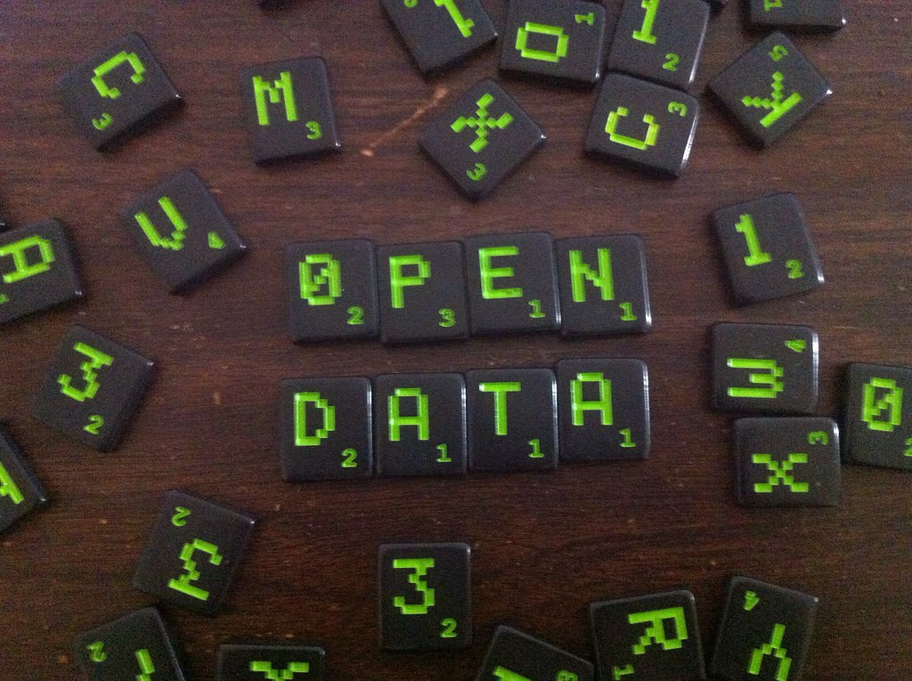

### Project name

Common data structure

##### Description

This project contains information about the common data structure that [AF-Connect](https://github.com/MagnumOpuses/af-connect) will be providing as a response.

The structure follows the [HROpen standard](https://hropenstandards.org/) completely at the moment. If the standard does not satisfy the needs of the project it will be adapted accordingly. Please get in contact with any comments, changes or additions, we are very eager to make this work for the whole of the swedish labour market.

###### Planed Use
This structure will keep being used by the Gravity team for any projects exporting data from Arbetsformedlingen, to increase data cohesion and understanding in the labour market. For this reason, while the adoption of this standard is optional but would be appreciated, a relatively good knowledge and understanding of it is expected. 

There is a plan for adding (or finding and repurposing existing sections of the structure) that will be describing the Gig market. Please contact us with any ideas or comments regarding this or any other information you would like added.

This project also adds an [envelope](https://github.com/MagnumOpuses/common-cv-model/tree/master/envelope) to the structure that is used to wrape and transfer the data for the purposes of [AF-Connect](https://github.com/MagnumOpuses/af-connect). In the same folder as the definition an example of the full response from [AF-Connect project](https://github.com/MagnumOpuses/af-connect) can be [found](https://github.com/MagnumOpuses/common-cv-model/blob/master/envelope/example_WithHROpen421.json). This example can be validated with the code found in the "validator" folder. Instructions for that can be found in the installation adn testing sections of this README. 

Examples for each part of the structure can be found along side the definitions in their designated folder. With the exception of the envelope and its examples, all other examples have been generated by the HROpen consortium.

###### Future work
It is understood that this structure is quite extensive and rich and includes a lot of sections that might seem irrelevant at the moment. They have been kept both because the organization feels that it should provide a solution that can cover all the needs of the labour market, and because they can be repurposed to accommodate other sections not yet added in the structure. The part of the structure that is used in the [AF-Connect project](https://github.com/MagnumOpuses/af-connect) is CandidateType and the substructures it requires. The exact structures used can be found in the resources folder of that repository/project.

This is only the first version of this common structure and we are looking forward to input from users and collaborators, through pull requests.

##### Versions, current dev state and future

###### Current Version
1.0.0

###### Future Additions

##### Source code

https://github.com/MagnumOpuses/common-cv-model

